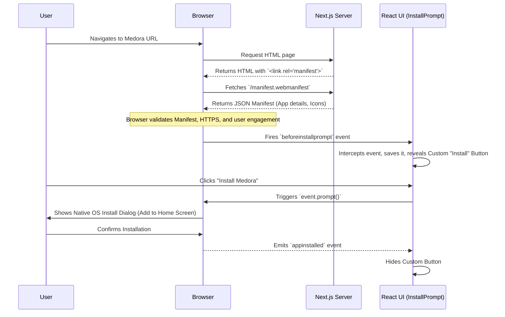

# Progressive Web App (PWA) Architecture & Guide

A **Progressive Web App (PWA)** is a web application that uses modern web capabilities to deliver an app-like experience to users. PWAs can be installed on a user's home screen, work offline, and send push notifications, bridging the gap between web and native mobile apps.

This document breaks down how the Medora platform achieves its installable PWA functionality and provides a complete guide for you to build your own.

---

## 1. How Medora Integrates PWA Capabilities

In the Medora project, the PWA implementation relies on two core pillars that satisfy modern browser (specifically Chromium-based) installation requirements:

1.  **Dynamic Web App Manifest (`manifest.ts`)**
2.  **Custom Install Prompt Handling (`InstallPrompt.tsx`)**

### Architecture Diagram: PWA Installation Flow



### The Two Components in Detail

#### A. The Manifest (`web/app/manifest.ts`)
Next.js 14+ allows you to generate a manifest file programmatically using the `MetadataRoute.Manifest` type. This file tells the browser the app's name, theme colors, icons, and display mode (`standalone` removes the browser URL bar so it looks like a native app).

#### B. The Custom Prompt (`web/components/ui/InstallPrompt.tsx`)
Modern browsers do not automatically force an install popup. Instead, they fire a window event called `beforeinstallprompt`. In Medora, we use a React component that listens for this event, prevents the default behavior, and shows our own stylized "Install" button. When the user clicks our button, we call the native `.prompt()` method.

---

## 2. How to Build Your Own PWA from Scratch

If you want to implement this in a new project (e.g., using Next.js or React), follow this exact blueprint.

### Step 1: Meet the Prerequisites
To be installable, your web app MUST have:
- Served over **HTTPS** (or `localhost` for development).
- A valid **Web App Manifest** (JSON format) containing at least:
  - `short_name` or `name`
  - `icons` (must include a 192x192px and 512x512px icon)
  - `start_url`
  - `display` (set to `standalone` or `fullscreen`)

### Step 2: Create the Web App Manifest
*If using Next.js App Router (like Medora), create `app/manifest.ts`:*

```typescript
import type { MetadataRoute } from 'next'
 
export default function manifest(): MetadataRoute.Manifest {
  return {
    name: 'My Awesome PWA',
    short_name: 'AwesomeApp',
    description: 'An example of a progressive web app',
    start_url: '/',
    display: 'standalone', // Makes it look like a native app (no browser UI)
    background_color: '#ffffff',
    theme_color: '#000000',
    icons: [
      {
        src: '/icon-192x192.png',
        sizes: '192x192',
        type: 'image/png',
      },
      {
        src: '/icon-512x512.png',
        sizes: '512x512',
        type: 'image/png',
      },
    ],
  }
}
```
*If using standard React/HTML, create a `manifest.json` in your public folder and link it in your `<head>`: `<link rel="manifest" href="/manifest.json">`*

### Step 3: Implement the Custom Install Button

Create a React component to intercept the browser's install event so you can control exactly *when* and *where* to ask the user to install your app.

```tsx
import { useEffect, useState } from 'react';

// Extend WindowEventMap to include the PWA event
interface BeforeInstallPromptEvent extends Event {
  prompt: () => Promise<void>;
  userChoice: Promise<{ outcome: 'accepted' | 'dismissed' }>;
}

export default function InstallButton() {
  const [installEvent, setInstallEvent] = useState<BeforeInstallPromptEvent | null>(null);

  useEffect(() => {
    // 1. Listen for the native browser event
    const handleBeforeInstallPrompt = (e: Event) => {
      // Prevent the default mini-infobar from appearing on mobile
      e.preventDefault();
      // Save the event so we can trigger it later
      setInstallEvent(e as BeforeInstallPromptEvent);
    };

    window.addEventListener('beforeinstallprompt', handleBeforeInstallPrompt);

    return () => {
      window.removeEventListener('beforeinstallprompt', handleBeforeInstallPrompt);
    };
  }, []);

  const handleInstallClick = async () => {
    if (!installEvent) return;
    
    // 2. Show the native install prompt
    await installEvent.prompt();
    
    // 3. Wait for the user to respond to the prompt
    const { outcome } = await installEvent.userChoice;
    
    if (outcome === 'accepted') {
      console.log('User accepted the install prompt');
    } else {
      console.log('User dismissed the install prompt');
    }
    
    // 4. We can't use the event again, so clear it
    setInstallEvent(null);
  };

  // If the event hasn't fired, the app is already installed or the browser doesn't support it
  if (!installEvent) return null;

  return (
    <button onClick={handleInstallClick} className="bg-blue-500 text-white p-2 rounded">
      Install App to Home Screen
    </button>
  );
}
```

### Step 4 (Advanced/Optional): Adding Offline Support

While Medora focuses on the "Installability" of PWAs, true PWAs also work offline. To do this, you need a **Service Worker**. 
In Next.js, the easiest way to add offline caching is to use a library like `next-pwa`.

1. Install it: `npm install next-pwa`
2. Update your `next.config.js`:
```javascript
const withPWA = require('next-pwa')({
  dest: 'public',       // Where to output the service worker file
  disable: process.env.NODE_ENV === 'development', // Disable during dev
})

module.exports = withPWA({
  // Your normal next config
})
```
This will automatically generate a Service Worker that caches your HTML, CSS, JS, and Images, allowing your app to load even when the user has no internet connection!

---

## Summary of PWA Capabilities
| Feature | Required Tech | Medora Status | Description |
| :--- | :--- | :--- | :--- |
| **Installable** | Web Manifest (`manifest.json`) | ✅ Yes | Can be added to home screen / desktop. |
| **Custom Prompt** | `beforeinstallprompt` event | ✅ Yes | Custom UI button rather than native popup. |
| **Offline Mode** | Service Worker (`fetch` cache) | ❌ No | Caches assets so the app loads without internet. |
| **Push Notifications**| Push API & Service Worker | ❌ No | Native notifications sent from a server. |
